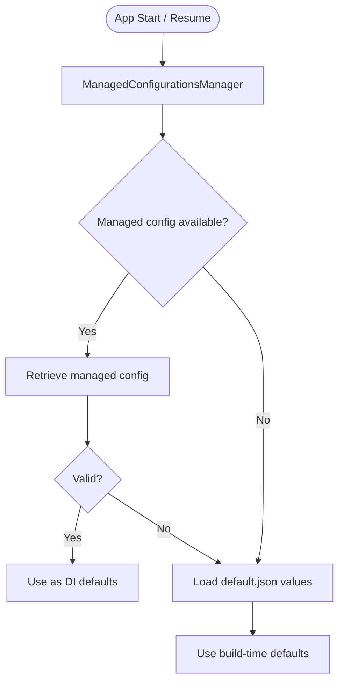

Wire Android ships with a default backend configuration baked in at build time via [`default.json`](/configuration/build-flags#backend-defaults). Users and enterprise administrators can also point the app at a different backend without rebuilding.

---

## Default backend endpoints

The following URLs are compiled into the app and used on first launch. They can be overridden per-flavor or via a custom build.

### Production (`prod` and `fdroid` flavors)

| Field | URL |
|---|---|
| `default_backend_url_base_api` | `https://prod-nginz-https.wire.com` |
| `default_backend_url_accounts` | `https://account.wire.com` |
| `default_backend_url_base_websocket` | `https://prod-nginz-ssl.wire.com` |
| `default_backend_url_teams` | `https://teams.wire.com` |
| `default_backend_url_blacklist` | `https://clientblacklist.wire.com/prod` |
| `default_backend_url_website` | `https://wire.com` |
| `default_backend_title` | `wire-production` |

### Staging (`staging` flavor)

| Field | URL |
|---|---|
| `default_backend_url_base_api` | `https://staging-nginz-https.zinfra.io` |
| `default_backend_url_accounts` | `https://wire-account-staging.zinfra.io` |
| `default_backend_url_base_websocket` | `https://staging-nginz-ssl.zinfra.io` |
| `default_backend_url_teams` | `https://wire-teams-staging.zinfra.io` |
| `default_backend_url_blacklist` | `https://clientblacklist.wire.com/staging` |
| `default_backend_url_website` | `https://wire.com` |
| `default_backend_title` | `wire-staging` |

### Dev (`dev` flavor)

| Field | URL |
|---|---|
| `default_backend_url_base_api` | `https://nginz-https.anta.wire.link` |
| `default_backend_url_accounts` | `https://account.anta.wire.link` |
| `default_backend_url_base_websocket` | `https://nginz-ssl.anta.wire.link` |
| `default_backend_url_teams` | `https://teams.anta.wire.link` |
| `default_backend_url_blacklist` | `https://clientblacklist.wire.com/staging` |
| `default_backend_url_website` | `https://wire.com` |
| `default_backend_title` | `wire-anta` |

<Info>
  The `beta` and `internal` flavors do not define flavor-specific backend URLs. They inherit the production endpoints from the global defaults in `default.json`.
</Info>

---

## Backend URL fields

<ParamField body="default_backend_url_base_api" type="string">
  The root URL for all Wire backend REST API calls. All API requests are sent to this host.
</ParamField>

<ParamField body="default_backend_url_accounts" type="string">
  URL of the Wire account management portal. Used for deep links to password reset, email verification, and account settings pages.
</ParamField>

<ParamField body="default_backend_url_base_websocket" type="string">
  WebSocket endpoint for real-time event delivery. Only used when `websocket_enabled_by_default` is `true` or the user has opted in to persistent WebSocket connections.
</ParamField>

<ParamField body="default_backend_url_teams" type="string">
  URL of the Wire team management web app. Used for in-app links to team settings.
</ParamField>

<ParamField body="default_backend_url_blacklist" type="string">
  URL of the client version blacklist. The app fetches this periodically and blocks usage if the current version is listed. See [Client version enforcement](#client-version-enforcement).
</ParamField>

<ParamField body="default_backend_url_website" type="string">
  Base URL of the Wire website. Used for help, support, and marketing links within the app.
</ParamField>

<ParamField body="default_backend_title" type="string">
  Human-readable name for the backend, shown in developer and debug screens.
</ParamField>

---

## Certificate pinning

The `cert_pinning_config` field maps SHA-256 public key pins to lists of hostname glob patterns. Pinning is enforced at the network layer for all matching hostnames.

### Default production pin

```json
"cert_pinning_config": {
    "sha256/fnBeCwh0imI9t46Onid49IwvsB5vcf7RCvafRRdCyRE=": [
        "**.prod-nginz-https.wire.com",
        "**.prod-nginz-ssl.wire.com",
        "**.prod-assets.wire.com",
        "clientblacklist.wire.com"
    ]
}
```

The pin covers:
- The API endpoint (`prod-nginz-https.wire.com`) and all subdomains
- The WebSocket endpoint (`prod-nginz-ssl.wire.com`) and all subdomains
- The asset storage host (`prod-assets.wire.com`) and all subdomains
- The version blacklist host (`clientblacklist.wire.com`)

<Warning>
  Certificate pinning is only configured for the production backend by default. Custom builds pointing at on-premise backends must supply their own `cert_pinning_config` or set it to `{}` to disable pinning.
</Warning>

### Disabling pinning

To disable certificate pinning for a custom build, set `cert_pinning_config` to an empty object in `custom-reloaded.json`:

```json
{
    "cert_pinning_config": {}
}
```

### Adding a custom pin

To pin an on-premise backend:

```json
{
    "cert_pinning_config": {
        "sha256/<your-base64-pin>=": [
            "**.yourdomain.example.com"
        ]
    }
}
```

The pin hash must be the Base64-encoded SHA-256 digest of the SubjectPublicKeyInfo (SPKI) of the leaf or intermediate certificate.

---

## WebSocket vs push notifications

<ParamField body="websocket_enabled_by_default" type="boolean" default="false">
  Controls the default message delivery mechanism.

  - `false` (default) — The app uses **Firebase Cloud Messaging (FCM)** to receive push notifications. The WebSocket connection is only opened when the app is in the foreground.
  - `true` — The app maintains a **persistent WebSocket connection** to the backend for real-time delivery. Suitable for environments without Google Play Services (e.g., F-Droid builds, Huawei devices, or air-gapped networks).
</ParamField>

<Tabs>
  <Tab title="FCM (default)">
    Battery-efficient push delivery using Google's Firebase infrastructure. Requires Google Play Services on the device.

    ```json
    "websocket_enabled_by_default": false
    ```
  </Tab>
  <Tab title="WebSocket">
    Always-on connection to the Wire backend WebSocket endpoint. Works on any Android device regardless of Google Play Services availability.

    ```json
    "websocket_enabled_by_default": true
    ```

    <Note>
      A persistent WebSocket connection consumes more battery than FCM. Consider this trade-off for user-facing builds.
    </Note>
  </Tab>
</Tabs>

---

## Client version enforcement

The app periodically fetches the URL at `default_backend_url_blacklist`. If the running app version appears in the response, the app displays a mandatory upgrade prompt and blocks further use until the user updates.

- **Production blacklist:** `https://clientblacklist.wire.com/prod`
- **Staging blacklist:** `https://clientblacklist.wire.com/staging`

To disable blacklist enforcement entirely, set `enable_blacklist` to `false` in `default.json` or your `custom-reloaded.json`:

```json
{
    "enable_blacklist": false
}
```

<Warning>
  Disabling the blacklist removes Wire's ability to force-update clients with critical security patches. Only disable this for isolated or air-gapped deployments.
</Warning>

---

## Custom backend support

Users can point the app at a different backend without rebuilding by opening a Wire backend deep link. This is useful for on-premise deployments.

The deep link URL format is:

```
https://wire.com/open-link?username=&code=&type=backend&cookie=&api=https://your-backend-api.example.com
```

When the user opens this link, the app presents a dialog asking them to confirm the backend switch. After confirming, the app authenticates against the new backend.

<Info>
  Custom backend connections are not restricted by `cert_pinning_config` unless the custom backend's hostname matches a pinned pattern. Configure `cert_pinning_config` accordingly for on-premise deployments.
</Info>

---

## Enterprise-managed backend (EMM)

When `emm_support_enabled` is `true` (the default), IT administrators can push backend configuration to managed devices using an MDM (Mobile Device Management) solution without user interaction.

### How it works

<Steps>
  <Step title="IT admin configures managed restrictions">
    The administrator pushes app restrictions via their MDM console (e.g., Google Workspace, Microsoft Intune, VMware Workspace ONE). The restrictions include the backend URL and optionally a default SSO code.
  </Step>
  <Step title="App reads managed configuration">
    On startup and on resume, the app queries Android's `RestrictionsManager` to check for managed configuration values.
  </Step>
  <Step title="Managed config applied as defaults">
    If valid managed configuration is found, the app uses it as the backend and SSO defaults — overriding the values baked in at build time via `default.json`.
  </Step>
  <Step title="Fallback to build-time defaults">
    If no managed configuration is present, or if the configuration is invalid, the app falls back to the URLs compiled in at build time.
  </Step>
</Steps>



<Note>
  The EMM backend configuration is also refreshed when the MDM solution broadcasts a configuration change via `RestrictionsManager`. The app handles this broadcast and re-evaluates settings without requiring a restart.
</Note>

### Disabling EMM support

To opt out of EMM managed configuration entirely:

```json
{
    "emm_support_enabled": false
}
```

This removes the dependency on `RestrictionsManager` and the app will always use build-time backend defaults.

---

## Overriding backend URLs in a custom build

To produce a build pre-configured for an on-premise backend, provide a `custom-reloaded.json` in your [customization repository](/configuration/customization):

```json
{
    "flavors": {
        "prod": {
            "default_backend_url_base_api": "https://wire-api.yourcompany.example.com",
            "default_backend_url_accounts": "https://wire-account.yourcompany.example.com",
            "default_backend_url_base_websocket": "https://wire-websocket.yourcompany.example.com",
            "default_backend_url_teams": "https://wire-teams.yourcompany.example.com",
            "default_backend_url_blacklist": "https://wire-api.yourcompany.example.com/blacklist",
            "default_backend_url_website": "https://yourcompany.example.com",
            "default_backend_title": "Acme Corp Wire",
            "cert_pinning_config": {
                "sha256/<your-spki-hash>=": [
                    "**.yourcompany.example.com"
                ]
            }
        }
    }
}
```
